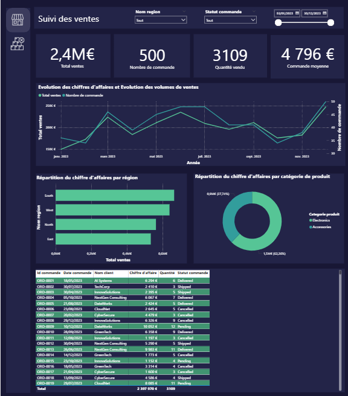

# Rapport de Ventes — Projet Power BI

Résumé
- Projet Power BI contenant un rapport de ventes interactif généré à partir d'un fichier CSV.
- Fichiers principaux :
  - Rapport Power BI : [rapport_vente.pbix](rapport_vente.pbix)
  - Source de données : [data/sales_2.csv](data/sales_2.csv)
  - Thème visuel : [data/Loomey Lime Theme.json](data/Loomey Lime Theme.json)
  - Icônes : [icones/](icones/)
    - [icones/annulation filtres.png](icones/annulation filtres.png)
    - [icones/commandes annulées.png](icones/commandes annulées.png)
    - [icones/produits bureautique.png](icones/produits bureautique.png)
    - [icones/produits mobiles.png](icones/produits mobiles.png)
    - [icones/ventes.png](icones/ventes.png)

 
Images  

- Page d'accueil :
  
  

- Page de suivi des commandes :
  
  

Structure des données
- Fichier : [data/sales_2.csv](data/sales_2.csv)
- En-tête (colonnes disponibles) :  
  - [`sales.OrderID`](data/sales_2.csv)  
  - [`sales.CustomerID`](data/sales_2.csv)  
  - [`sales.CompanyName`](data/sales_2.csv)  
  - [`sales.ProductID`](data/sales_2.csv)  
  - [`sales.ProductName`](data/sales_2.csv)  
  - [`sales.Category`](data/sales_2.csv)  
  - [`sales.RegionID`](data/sales_2.csv)  
  - [`sales.RegionName`](data/sales_2.csv)  
  - [`sales.OrderDate`](data/sales_2.csv)  
  - [`sales.Quantity`](data/sales_2.csv)  
  - [`sales.UnitPrice`](data/sales_2.csv)  
  - [`sales.TotalPrice`](data/sales_2.csv)  
  - [`sales.OrderStatus`](data/sales_2.csv)  

Consignes d'utilisation
- Ouvrir le rapport :
  1. Installer Power BI Desktop (version recommandée : la plus récente).
  2. Ouvrir le fichier [rapport_vente.pbix](rapport_vente.pbix).
- Mettre à jour les données :
  - Remplacer ou éditer [data/sales_2.csv](data/sales_2.csv) puis dans Power BI : Accueil → Actualiser.
  - Si vous modifiez les noms/colonnes du CSV, vérifier les étapes de transformation (Power Query) dans le rapport pour corriger les références.
- Thème et visuel :
  - Le thème visuel utilisé est [data/Loomey Lime Theme.json](data/Loomey Lime Theme.json). Pour l'appliquer dans Power BI : Vue → Thèmes → Importer un thème.
  - Les icônes sont stockées dans le dossier [icones/](icones/) et peuvent être utilisées comme images ou boutons dans le rapport.

Bonnes pratiques
- Colonnes datetime : vérifier le type de [`sales.OrderDate`](data/sales_2.csv) dans Power Query pour utiliser les fonctions temporelles.
- Types numériques : s'assurer que [`sales.Quantity`](data/sales_2.csv), [`sales.UnitPrice`](data/sales_2.csv) et [`sales.TotalPrice`](data/sales_2.csv) sont reconnus comme numériques.
- Relations : si vous ajoutez tables complémentaires (clients, produits, régions), créer des tables dimensionnelles et lier via `CustomerID`, `ProductID`, `RegionID`.

Visualisations recommandées (déjà présentes dans le .pbix)
- KPI en tête : nombre de commandes, CA total, panier moyen.
- Série temporelle : évolution du CA / nombre de commandes par date.
- Histogrammes / barres : top produits, top clients, répartition par région.
- Treemap / donut : part de marché par catégorie / statut de commande.
- Sankey / flux (si disponible) : parcours produit → région → statut.

Dépannage rapide
- Erreur d'actualisation : vérifier le séparateur CSV et l'encodage (UTF-8).
- Valeurs manquantes : inspecter Power Query (Transformations appliquées).
- Visuels cassés après modification du CSV : vérifier noms de colonnes et types.

Contribution
- Modifier le CSV dans [data/sales_2.csv](data/sales_2.csv) pour tester de nouveaux jeux de données.
- Mettre à jour le thème dans [data/Loomey Lime Theme.json](data/Loomey Lime Theme.json) si nécessaire.
- Les images/icônes : déposer dans [icones/](icones/) et pointer vers elles depuis le rapport.

Licence et contact
- Ce dépôt contient uniquement les fichiers du rapport et sources de données. Adapter la licence selon vos besoins.
- Fichier du rapport principal : [rapport_vente.pbix](rapport_vente.pbix).

Notes finales
- Les captures du rapport
  Images  

- Page d'accueil :  
  

- Page de suivi des commandes :  
  
- Pour toute modification avancée (DAX, modèles de données) ouvrir le .pbix et éditer dans Power BI Desktop.
